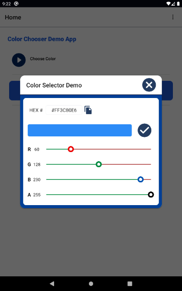
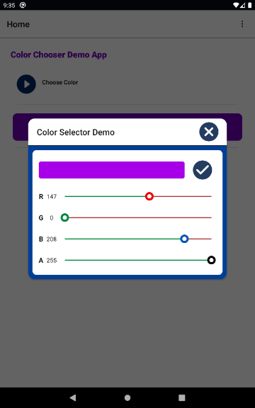

# Color Selector

## A practical colour selector plugin for android, by ProductiveMinds

### Objective
Add this simple but practical plugin to your Android project and easily implement as your color selector for applying colour to both background and foreground of views. 


### Installation
1. Download or clone the project
2. Open in Android Studio or your favourite IDE
3. Add to your project, as you please. For example, you could import as a new module, then reference in your gradle file.


### Content
1. Java classes
2. Layout files for displaying the colour selectors
3. Drawable resources for styling the views
4. Minimum SDk support = 21

- ColorSelector.java class is the wrapper class that extends Android's Color.java. You are unlikely to refer to this class unless you are extending it.
- ColorSliderUi.java class - you will be using this class mostly. The class calls the colour selector popup and is responsible for the selection process.


### Example Implementation Steps
Once installed, Instantiate and implement ColorSliderUi.java class. 
Below is an example implementation.
```java
ColorSliderUi colorSliderUi = new ColorSliderUi();
colorSliderUi.showDialogColorSelector(MyActivity.this, true, true, "Select Text colour");
```

Above, the four parameters are
1. The activity that implements color selector.
2. If true, the hex code label will be visible.
3. If true, user can close the color popup by clicking anywhere on the screen. If false, the popup can only be closed by clicking appropriate buttons.
4. The title of the popup


### Applying a selected colour

#### Applying the color is easy, the plugin provides 2 methods.

##### Method 1 - handle the triggered interface, as demonstrated below...
```java
colorSliderUi.setOnColorSelectedListener(new ColorSliderUi.OnColorSelectedListener() {
    @Override
    public void getOnColorStringSelectedListener(String color) {
    }

    @Override
    public void getOnColorIntSelectedListener(int color) {
        sample_textview.setTextColor(ColorStateList.valueOf(color));
    }

    @Override
    public void getOnColorAlphaSelectedListener(int color) {

    }
    @Override
     public void getOnColorIntSelectedBtnClickedListener(int color) {
        sample_textview.setTextColor(ColorStateList.valueOf(color));
    }
});
```

Above, the four interfaces return values as follows: 
- The hex code, 
- The int equivalent of the hex code, 
- The alpha value for the 'A' slider, and 
- The int equivalent of the hex code. 

Note that both second and fourth interfaces return the int value. The difference is that, the second interface sends a response with each slider change while the fourth interface only returns value, when (or if) the user clicks the check button.

As the fourth interface only send a response on final click, it gives the option to configure regular updates or one final update only.

** Method 2 - retrieve saved values in the shared preference
If not using the interfaces, the plugin provides corresponding key/value pairs in the shared preference, as shown below...
```java
UserPreferencesManager.setStringPrefValue(context,
        ProjectConstants.C_S_HEX_LATEST, hexCode);
UserPreferencesManager.setIntPrefValue(context,
        ProjectConstants.C_S_ARGB_COLOR_LATEST, ColorSelector.COLOR_ENCODED);
```


Above, shared preference keys are set for the hex code, and also the alpha.
You can use the hex code, for example, by calling..
```java
String hexCodeColor = UserPreferencesManager.getStringPrefValue(context,
        ProjectConstants.C_S_HEX_LATEST, hexCode);
sample_textview.setTextColor(ColorStateList.valueOf(Color.parseColor(color)));
```


The interfaces and shared preference values are set in ColorSliderUi.java.
Each method described above will set the color of the textview, sample_textview, to the selected colour.


### Screenshots




You are welcome to initiate contact for comments or suggestions - productivminds@gmail.com


